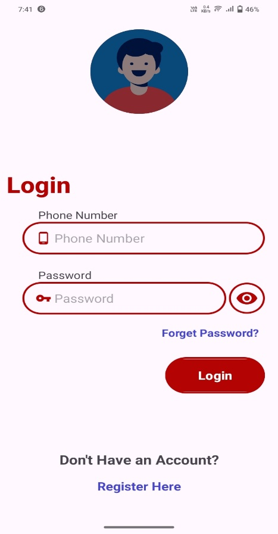
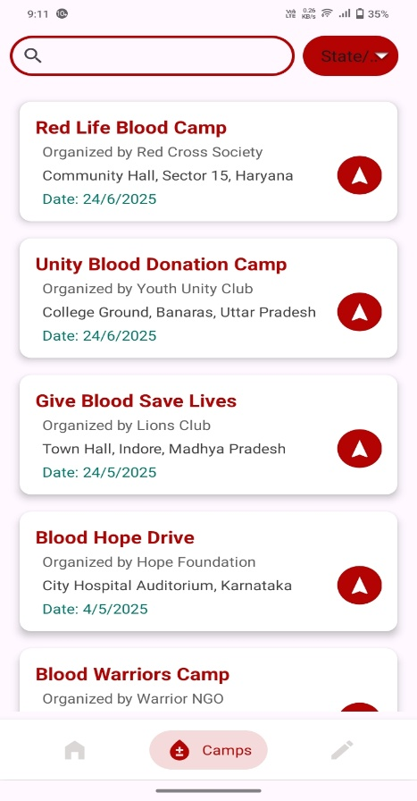

# 🩸 BloodMate – Full-Stack Blood Donation Management System

**BloodMate** is a full-stack blood donation platform designed to connect donors, recipients, and administrators efficiently.  
It includes an **Android app frontend**, a **Spring Boot backend**, and a **web-based admin panel** built with HTML and CSS.

---

## 🚀 Features

### Android App (Frontend)
- Donor registration & profile management  
- Blood request creation & tracking  
- Notifications for donation requests  
- View upcoming donation camps/events  
- Communicates with backend via REST APIs

### Admin Panel (Frontend)
- Built with HTML and CSS  
- Manage blood requests (create, update, delete)  
- Assign/unassign donors  
- Track donor health information  
- Organize donation camps/events  
- Manage banners/images via **Cloudinary**

### Backend (Spring Boot)
- Handles all CRUD operations for donors, requests, and events  
- Provides REST APIs for Android app integration  
- Serves admin panel pages  
- Ready for future enhancements (authentication, notifications)

---

## 🛠️ Tech Stack

- **Mobile Frontend:** Android Studio, Java, XML  
- **Web Admin Panel:** HTML, CSS, JavaScript  
- **Backend:** Spring Boot  
- **Database:** MySQL  
- **Cloud Services:** Cloudinary (for image uploads)  
- **Tools:** IntelliJ IDEA, Android Studio, Postman, Git/GitHub

---

## 📂 Project Structure
BloodMate/  
┣ android-app/ # Android app frontend 
┃ ┣ app/src/main/java/ 
┃ ┗ app/src/main/res/ # XML layouts 
┣ backend/ # Spring Boot backend 
┃ ┣ src/main/java/... # Controllers, Services, Repositories, Models 
┃ ┣ src/main/resources/static/ # HTML/CSS admin panel 
┃ ┗ pom.xml 
┣ README.md 

---

## ⚙️ Setup & Run

### Backend (Spring Boot)
bash
cd backend
mvn spring-boot:run bash

Configure database credentials in application.properties or application.yml

Backend runs at http://localhost:8080
---
Android App

Open the project in Android Studio

Update the API base URL in Retrofit client (RetrofitClient.java)

Run on emulator or physical device

🧠 Key Highlights

Full-stack solution: Android + Spring Boot + Admin Panel

Clean separation of frontend and backend logic

Responsive HTML/CSS admin panel

REST APIs integrated with Android app

Easy to extend with authentication, notifications, and analytics

📸 Screenshots
-

### Android App

  &nbsp;&nbsp;&nbsp;&nbsp;&nbsp;&nbsp;&nbsp;&nbsp;&nbsp;&nbsp;&nbsp;&nbsp;&nbsp;&nbsp;&nbsp;&nbsp;&nbsp;&nbsp;&nbsp;&nbsp;&nbsp;&nbsp;&nbsp;&nbsp;
   &nbsp;&nbsp;&nbsp;&nbsp;&nbsp;&nbsp;&nbsp;&nbsp;&nbsp;&nbsp;&nbsp;&nbsp;&nbsp;&nbsp;&nbsp;&nbsp;&nbsp;&nbsp;&nbsp;&nbsp;&nbsp;&nbsp;&nbsp;&nbsp;
   

 
  

   &nbsp;&nbsp;&nbsp;&nbsp;&nbsp;&nbsp;&nbsp;&nbsp;&nbsp;&nbsp;&nbsp;&nbsp;&nbsp;&nbsp;&nbsp;&nbsp;&nbsp;&nbsp;&nbsp;&nbsp;&nbsp;&nbsp;&nbsp;&nbsp;
   &nbsp;&nbsp;&nbsp;&nbsp;&nbsp;&nbsp;&nbsp;&nbsp;&nbsp;&nbsp;&nbsp;&nbsp;&nbsp;&nbsp;&nbsp;&nbsp;&nbsp;&nbsp;&nbsp;&nbsp;&nbsp;&nbsp;&nbsp;&nbsp;
   

---

🤝 Contributing
-
Fork the repository

Create a new branch (feature/your-feature)

Commit your changes and open a pull request

---
🧑‍💻 Author
-

##### Abhishek Dhawan 
📧 [Email Address](mailto:abhidhawan1303@gmail.com) 
🔗 [GitHub](https://www.github.com/Code-Where)  
🔗 [LinkedIn](https://www.linkedin.com/in/abhishekdhawan786)  

---
📜 License
-
This project is licensed under MIT License.
